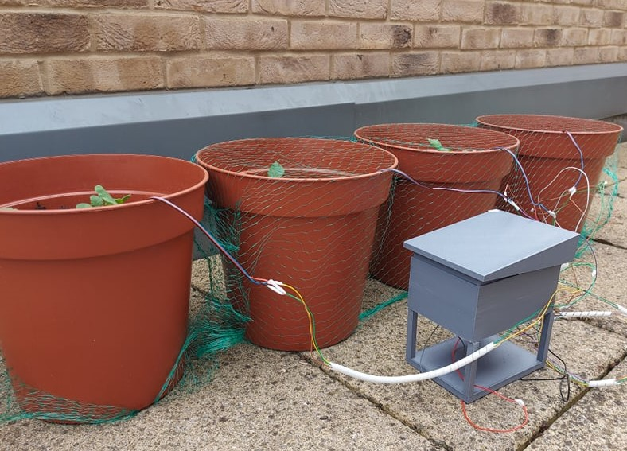
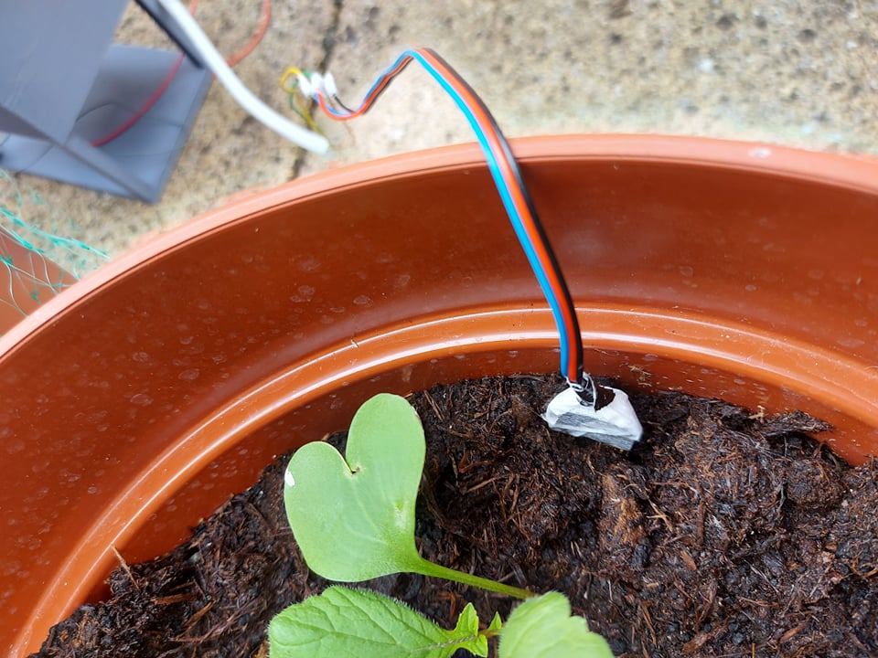
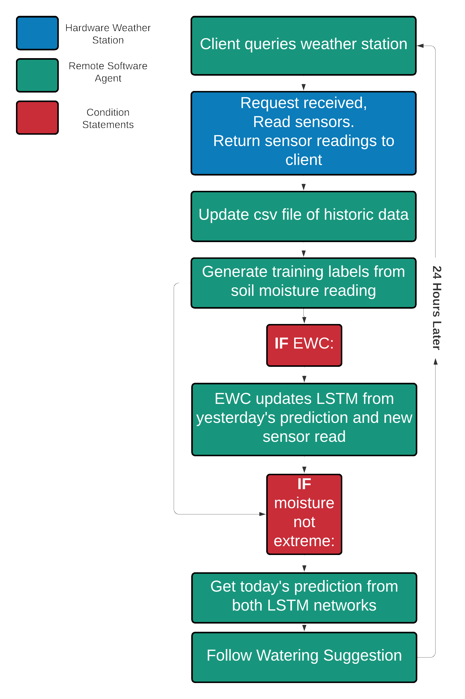
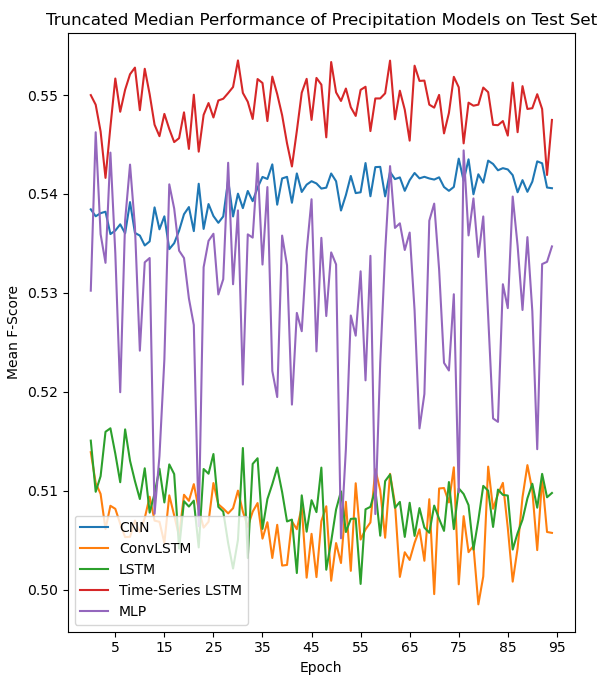
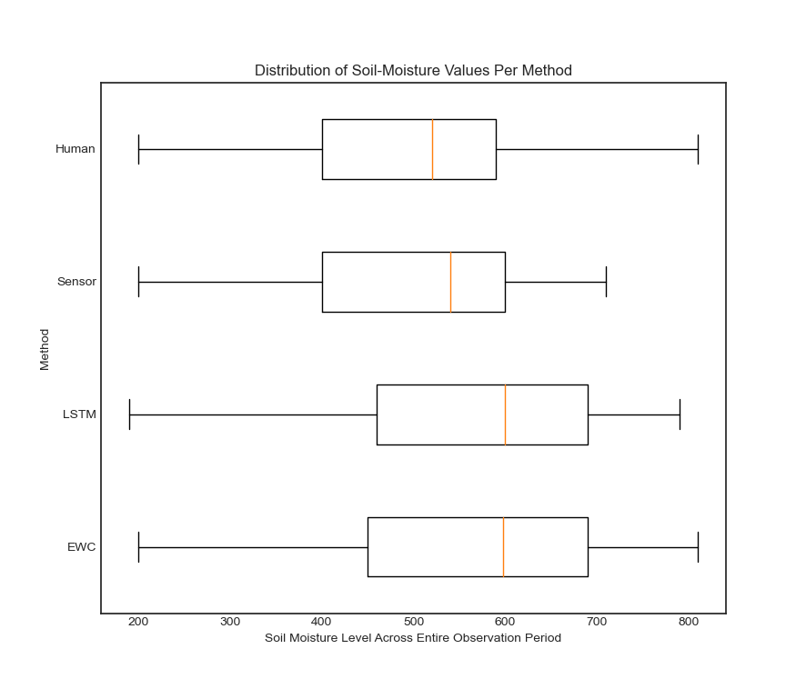
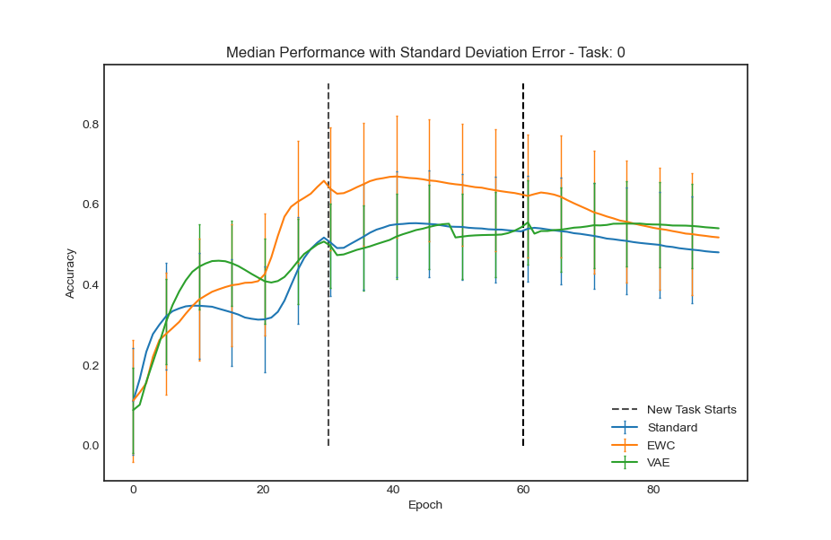
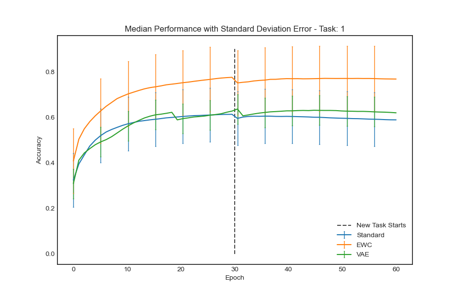
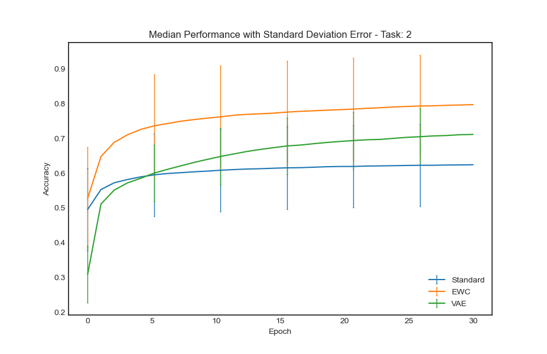

# Lifelong Learning For Closed Loop Soil-Moisture Control
## Abstract
Soil moisture control is a key challenge in optimising crop yield, which is increasingly important as food security is becoming less and less certain. This work presents a lifelong learning-based LSTM precipitation prediction model, paired with a bespoke sensor-based 3D-printed weather station, to facilitate the optimisation of soil-moisture. The results show that not only does our LSTM model outperform non-machine learning approaches to soil moisture control, but also that our novel application of the elastic weight consolidation (EWC) lifelong learning paradigm further improves soil moisture control. The project concludes with a novel extension of the elastic weight consolidation algorithm through application of a variational autoencoder to estimate an intractable likelihood term.

## Project Architecture
The project features 2 key components, the weather station (in-field sensor box), and the remote server hosting the machine learning model and decision making. 

### Weather Station
 The weather station contained an ESP32 microcontroller, connected to a 20v battery and the DHT11 humidity and temperature sensor, the BMP280 pressure sensor and four soil moisture sensors (one for each testbed).

The weather station operated on the ESP32 microcontroller, which naturally lends itself to taking on a 'server' role. Combining this with relays, the weather station operates on a low-energy mode until a request is received, at which point readings are taken and return to the client. 

 As the weather station was to be deployed outside, a 3D-printed case was created to protect the circuitry from the elements.
 

### Machine Learning Remote Server
The LSTM model was pretrained on weather data from France. Once deployed, elastic weight consolidation is  used to allow transfer learning to occur without overfitting to short-term weather conditions (thus avoiding catastrophic forgetting). The task of the LSTM is to predict precipitation for the coming 24hours from the barometric pressure, temperature, and humidity. This information is then combined with soil moisture readings to provide an informed decision on whether or not to water crops that considers both current and future states.

### Flowchart

As the weather station assumed the role of server, the remote machine learning logic is referred to as the client.

## Results
For complete results analysis, please refer to [paper](Papers/Lifelong_Learning_for_Closed_Loop_Soil_Moisture_Control)

## VAE Extension to EWC
While EWC works well, estimating the likelihood term $p(\theta|a)$ using the Laplace approximation may be too simple to appropriately model certain distributions. 

Variational autoencoders are predicated on variational Bayes', using binary cross entropy loss and the Kullback-Liebler divergence to find the best approximation of a distribution $p(x|z)$. By providing a VAE with  the LSTM network parameters as input, such that $x=\theta$, and by conditioning $z$ on the data of a given task, $a$, a variational autoencoder may be used to approximate the probability density function $p(\theta|a)$. 

## VAE Results

